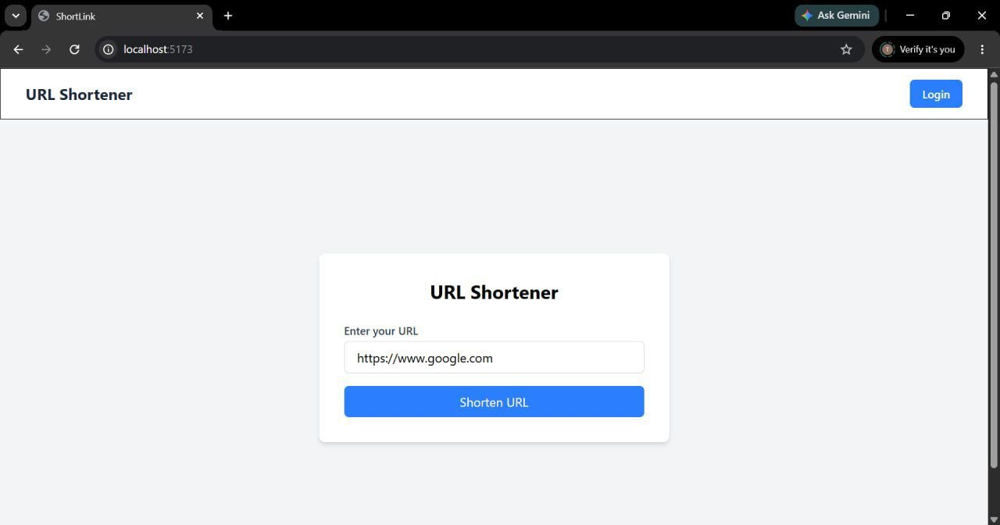
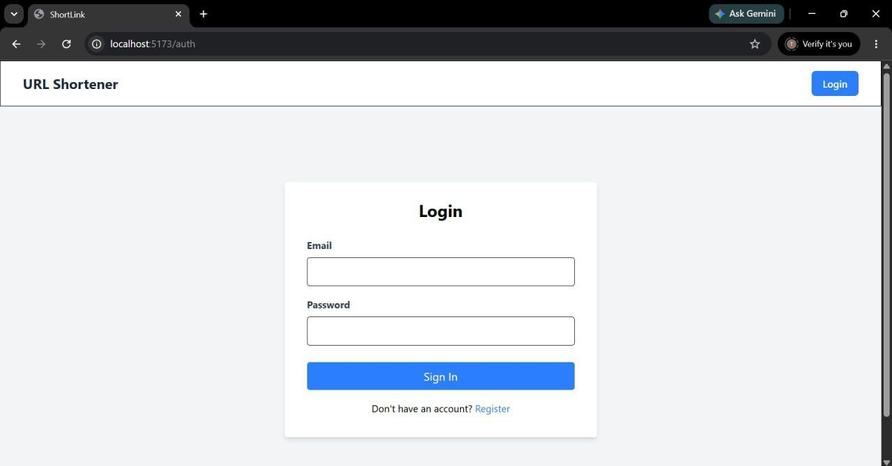
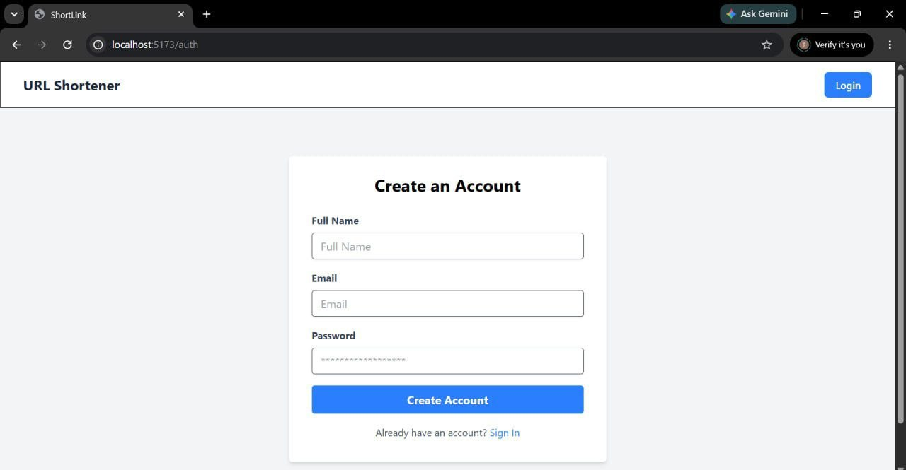
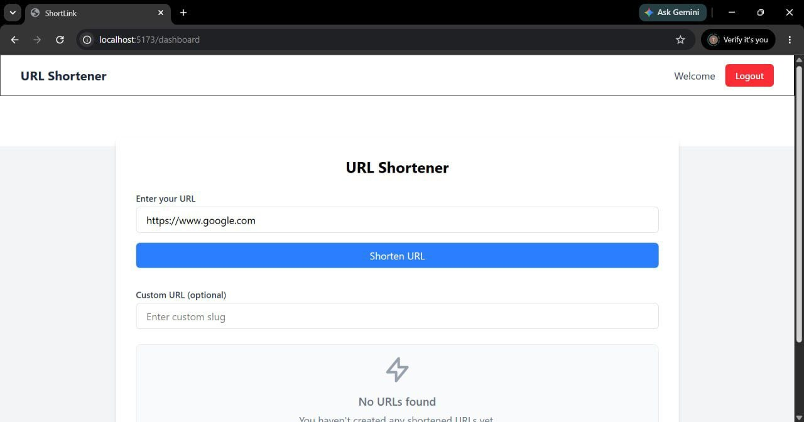
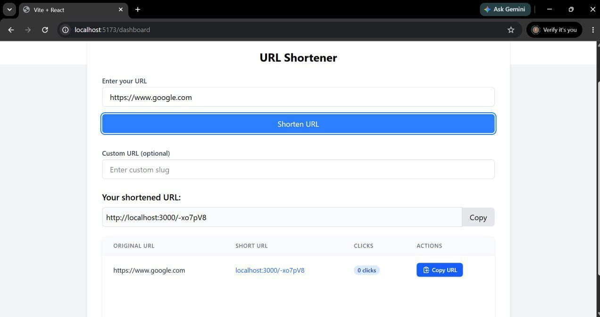
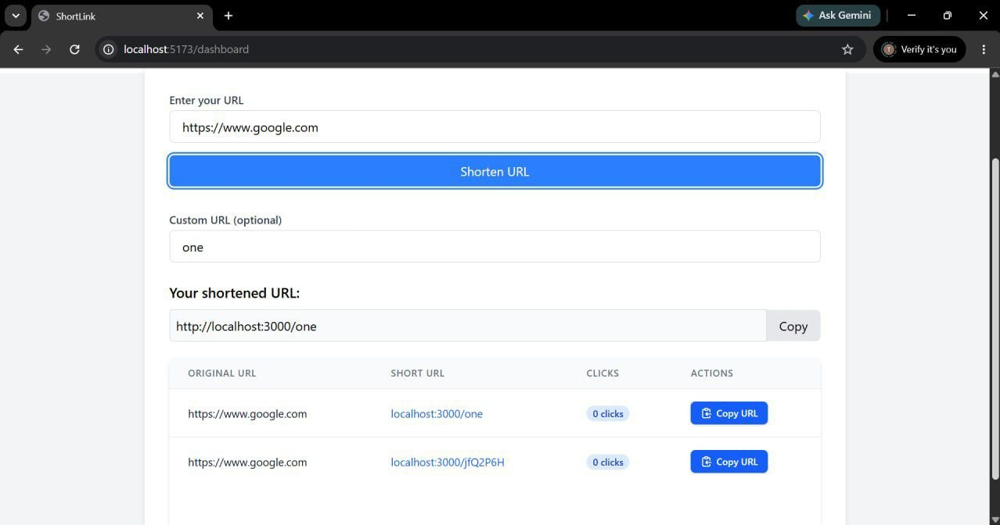
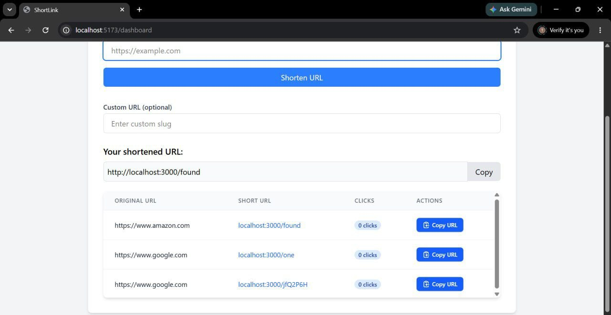

# 🔗 URL Shortener

A full-stack URL Shortener application built using **React (Tailwind CSS)** for frontend and **Node.js + Express + MongoDB** for backend.  
It allows users to create short links, manage them, and track analytics with secure authentication.

---

## 🚀 Features

### 👤 Authentication
- User Signup
- User Login
- User Logout
- JWT Authentication
- Protected Routes

### 🔗 URL Shortener
- Create short URLs
- Redirect to original URLs
- Generate unique short codes using nanoid
- Copy short link with one click

### 📊 Analytics
- Track total clicks per URL
- View user-specific URLs
- Monitor link usage

### 🔐 Security
- Password hashing using bcryptjs
- JWT stored in cookies
- Middleware protected routes

---

## 🛠️ Tech Stack

### Frontend
- React.js
- Tailwind CSS
- Axios
- React Router

### Backend
- Node.js
- Express.js
- MongoDB + Mongoose

### Authentication
- JWT (JSON Web Token)
- Cookies (HTTP-only)
- bcryptjs

---

## 📁 Project Structure

```text
url-shortener/
│
├── frontend/
│   ├── src/
│   │   ├── api/
│   │   ├── components/
│   │   ├── pages/
│   │   ├── store/
│   │   └── App.jsx
│   ├── public/
│   └── package.json
│
├── backend/
│   ├── src/
│   │   ├── config/
│   │   ├── controller/
│   │   ├── middleware/
│   │   ├── models/
│   │   ├── routes/
│   │   └── utils/
│   ├── app.js
│   └── package.json
│
└── README.md
```

## 📸 Screenshots

### 🏠 Home Page


### 🔐 Login Page


### 📝 Signup Page


### 📊 Dashboard


### 🔗 Create Short URL


### 🔗 Create Custom Short URL


### 📈 Analytics Page


## ⚙️ Installation & Setup

### 1. Clone Repository

```bash
git clone https://github.com/parth0811/url-shortener.git
cd url-shortener
```

---

## 🖥️ Backend Setup

```bash
cd backend
npm install
```

### Create `.env` file

```env
MONGO_URI=
CLIENT_URL=http://localhost:5173
APP_URL=http://localhost:3000
JWT_SECRET=
```

### Run Backend

```bash
npm run dev
```

Backend runs on:
```
http://localhost:3000
```

---

## 🌐 Frontend Setup

```bash
cd frontend
npm install
npm run dev
```

Frontend runs on:
```
http://localhost:5173
```

---

## 🔗 API Endpoints

### Auth Routes
```
POST /register     - User Signup
POST /login        - User Login
POST /logout       - User Logout
GET  /me           - Get Logged-in User
```

---

### URL Routes
```
POST /              - Create Short URL
POST /urls          - Get User URLs
GET  /:shortCode    - Redirect to Original URL
GET  /analytics/:id - Get URL Analytics
DELETE /:id         - Delete URL
```

---

## 🔄 How It Works

1. User registers or logs in
2. JWT token is stored in HTTP-only cookies
3. User creates a short URL
4. Backend generates a unique short code
5. Visiting short URL redirects to original URL
6. Clicks are tracked for analytics

---

## 🎯 Frontend Features

- Clean responsive UI using Tailwind CSS
- Login / Signup pages
- Dashboard to manage URLs
- Copy-to-clipboard functionality
- Protected routes for authenticated users

---

## 🔮 Future Improvements

- QR code generation for URLs
- Custom aliases
- Expiry time for links
- Advanced analytics dashboard
- Rate limiting
- Password reset system

---

## 👨‍💻 Author

**URL Shortener Project**

GitHub: https://github.com/parth0811

---

## 📜 License

This project is for educational and portfolio purposes.